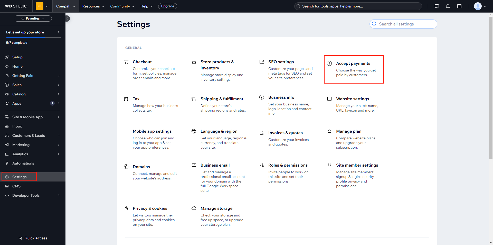

# Wix CoinPal Checkout Installation

## Step 1: Login to the CoinPal Admin Dashboard to get the Merchant Number and Secret Key.
1. [Register](https://portal.coinpal.io/#/admin/register)/[login](https://portal.coinpal.io/#/admin/login) and go to CoinPal's Admin Dashboard 

2. Follow the Dashboard guidelines to fill in the relevant information

3. Click the 'Integration' button in the lower left corner to get the corresponding Merchant No. and Secret Key

4. Click on the left column My Account -> My store -> New Store, enter relevant information, click Save, and obtain the relevant Access Token on the current page

## Step 2: Installing the CoinPal Plugin on your Wix Site.

1. Navigate to your Wix admin area and follow this path: Home -> Design Site，Create your website based on relevant guidance

2. Click on the "Tun on Developer Mode" button in Dev Mode

3. Click on "Public & Backend", move to the Bckend directory, and create Coinpal.js and http-functions.js

4. Move to the "Service Plugins" directory, click on "payment", and create a payment plugin called "CoinpalPayment"

5. Copy the relevant JS content from the plug_wix directory in GitHub to the corresponding JS file one by one

6. Click on "Packages & Apps", go to the mobile npm directory, and install "crypto-js"

   
7. In the upper right corner, click the "Publish" button to publish this website

8. Configure CoinPal Wix Gateway
   
   Go to the Wix Admin, click Settings -> Accept payments.
   
   Copy and Paste all of the Settings you generated in your CoinPal Dashboard on Step #1.
   
   Click "Connect" button.
   
   
   
   
   
   

9. Configure asynchronous notification key

    Go to the Wix Admin, click Developer Tools -> Secrets Manager -> Add Secret.
    
    Copy and Paste all of the Settings you generated in your CoinPal Dashboard on Step #1.
    
    Click "Add Secret" button.
    
    
    
    

## Step 3: Testing your CoinPal Wix Integration.

To confirm your Integration is properly working create a test order:

Add a test item to your shopping cart and view the cart.

Proceed to Checkout.

Select Pay Crypto With Coinpal Method.

Click the "Place Order & Pay" button.

Verify all of the Wallet Addresses and Order info, and make sure the Validation Tests all have a Green Check Mark.

If you like you can now proceed to making a test payment.

## Step 4: Marking a Payment as Received on Wix.

Login to your Wix Admin Dashboard.

Go to the Wix Section and Click Orders.

You will see the test orders marked as "Paid".

Check whether coins are settled to the CoinPal wallet.

You may also use a Block Explorer to verify if the transaction was processed.

After the verification of the above steps is completed, it means that the connection with CoinPal is successful.

